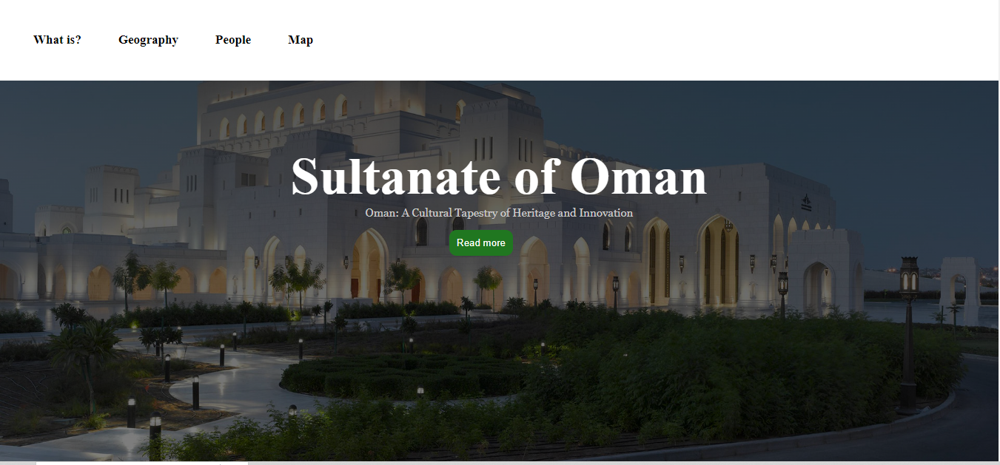
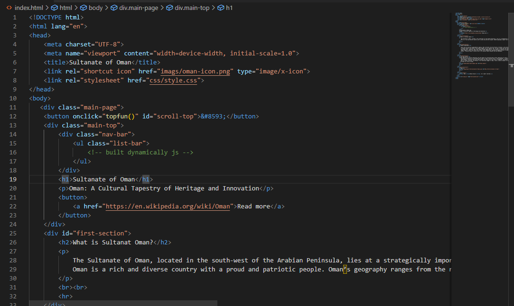
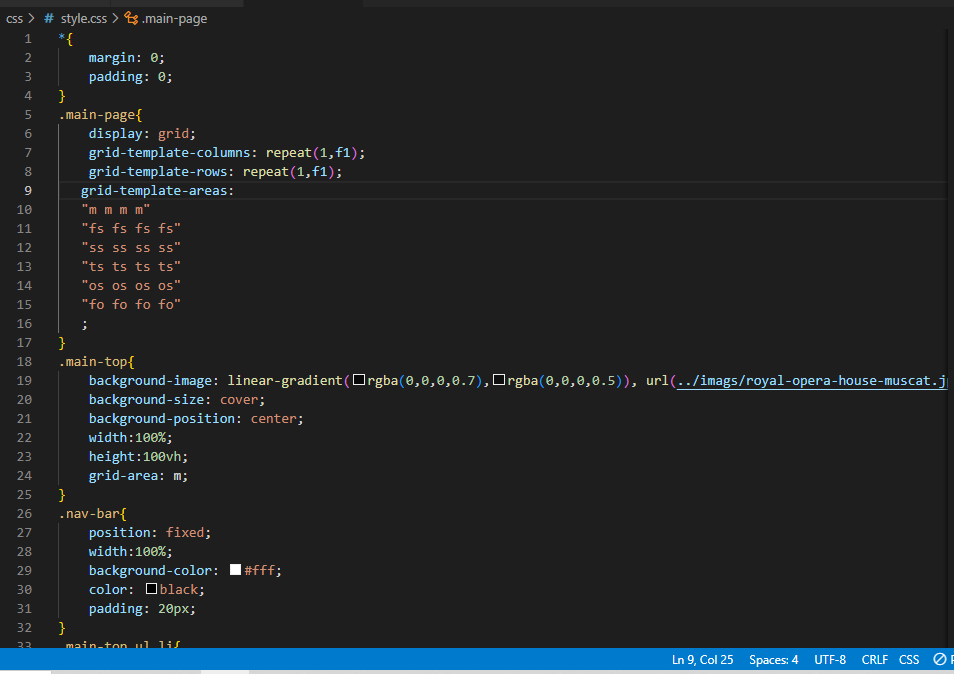
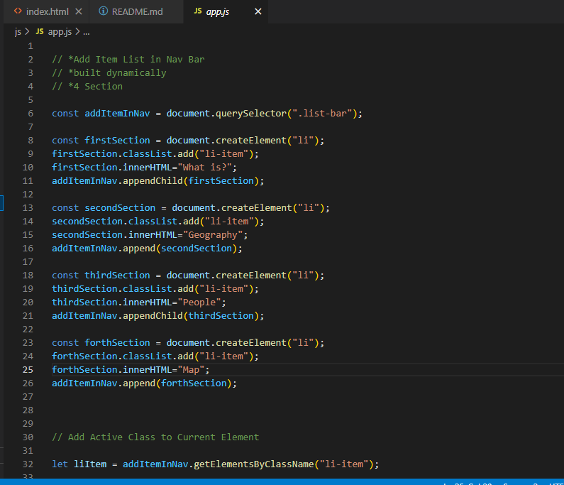

# How Createing Landing Page with Some Feature.

## Table of Contents:

+  [Project Title](#project-title).
+  [Project Description](#project-description).
+  [Landing Page Feature](#landing-page-feature).
+  [HTML Code](#html-code).
+  [CSS Code](#css-code).
+  [Js Code](#js-code).
  

### Project Title

Sultanate of Oman

### Project Description

This project aims to give you real-world scenarios of manipulating the DOM. The functionality you will be using serves two purposes: to prepare you for appending dynamically added data to the DOM, and to show you how javascript can improve the usability of an otherwise static site. This project barely touches the surface of what is possible, but it does use some incredibly common events, methods, and logic.

### Landing Page Feature

+ All features are usable across modern desktop, tablet, and phone browsers.
+ Set CSS class active state when the element is in the viewport.
+ Navigation is built dynamically as an unordered list
+ Detect the element location relative to the viewport using .getBoundingClientRect() built-in function.
+ Use addEventListener('click',....) to listen to the click event.
+ There are several javascript methods for scrolling, scroll(), scrollBy(), and scrollIntoView() are all acceptable.

### HTML Code

### CSS Code

### Js Code

